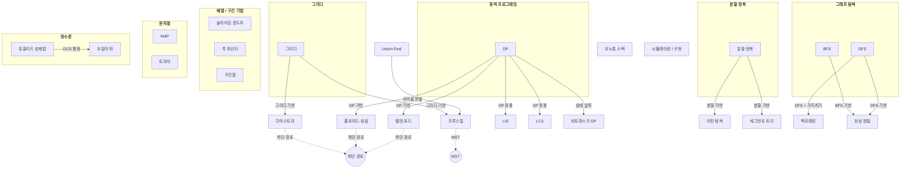

# 알고리즘 백과사전

코딩 테스트와 알고리즘 학습을 위한 백과사전입니다.  
각 알고리즘의 핵심 로직, 활용 상황, Java 구현 코드를 제공합니다.

> 총 **28개 알고리즘** | 15개 카테고리 | [자료구조 초기화 치트시트](basics/data-structure-init.md) | [테크닉 모음](techniques/problem-solving-techniques.md)

---

## 알고리즘 분류 및 관계도

> 화살표는 **"~를 기반으로 한다 / ~에서 활용된다"** 를 의미합니다.



### 핵심 관계 한눈에 보기

```
그리디 ─────┬──→ 다익스트라      (최단 경로를 그리디하게 선택)
            └──→ 크루스칼        (최소 간선부터 그리디하게 선택)

DP ─────────┬──→ 플로이드-워셜   (경유지 확장 DP)
            ├──→ 벨만-포드       (간선 완화 반복 DP)
            ├──→ LIS / LCS      (대표적 DP 응용)
            └──→ 비트마스크 DP   (집합 상태를 비트로 압축)

분할 정복 ──┬──→ 이진 탐색       (탐색 범위를 반으로 분할)
            └──→ 세그먼트 트리   (구간을 분할 정복으로 관리)

DFS ───────────→ 백트래킹        (DFS + 가지치기)
BFS / DFS ─────→ 위상 정렬       (Kahn's = BFS, 후위순회 = DFS)
Union-Find ────→ 크루스칼        (사이클 판별에 활용)
유클리드 호제법 → 오일러 피       (GCD 기반 계산)
```

---

## 카테고리별 목록

### 1. 그래프 탐색

| 알고리즘 | 핵심 키워드 | 시간 복잡도 |
|---------|-----------|------------|
| [BFS (너비 우선 탐색)](graph-traversal/bfs.md) | 최단 경로(무가중치), 레벨 탐색 | O(V + E) |
| [DFS (깊이 우선 탐색)](graph-traversal/dfs.md) | 경로 탐색, 사이클 검출, 연결 요소 | O(V + E) |
| [위상 정렬](graph-traversal/topological-sort.md) | 작업 순서, 의존성, DAG | O(V + E) |

### 2. 백트래킹

| 알고리즘 | 핵심 키워드 | 시간 복잡도 |
|---------|-----------|------------|
| [백트래킹](backtracking/backtracking.md) | 조합/순열, 제약 만족, N-Queens | O(N!) (최악) |

### 3. 최단 경로

| 알고리즘 | 핵심 키워드 | 기반 | 시간 복잡도 |
|---------|-----------|------|------------|
| [다익스트라](shortest-path/dijkstra.md) | 단일 출발점, 양수 가중치 | 그리디 | O(E log V) |
| [벨만-포드](shortest-path/bellman-ford.md) | 음수 가중치, 음수 사이클 검출 | DP | O(VE) |
| [플로이드-워셜](shortest-path/floyd-warshall.md) | 모든 쌍 최단 경로, 경유지 | DP | O(V³) |

### 4. 최소 신장 트리 (MST)

| 알고리즘 | 핵심 키워드 | 기반 | 시간 복잡도 |
|---------|-----------|------|------------|
| [MST 개요](minimum-spanning-tree/mst.md) | 최소 비용 연결, 프림 알고리즘 | - | - |
| [크루스칼](minimum-spanning-tree/kruskal.md) | 간선 정렬, Union-Find | 그리디 | O(E log E) |

### 5. 탐욕법 (그리디)

| 알고리즘 | 핵심 키워드 | 시간 복잡도 |
|---------|-----------|------------|
| [그리디](greedy/greedy.md) | 지역 최적 → 전역 최적, 활동 선택 | 문제마다 다름 |

> **하위 알고리즘**: [다익스트라](shortest-path/dijkstra.md), [크루스칼](minimum-spanning-tree/kruskal.md)

### 6. 동적 프로그래밍 (DP)

| 알고리즘 | 핵심 키워드 | 시간 복잡도 |
|---------|-----------|------------|
| [DP 기초](dynamic-programming/dp.md) | 최적 부분 구조, 중복 부분 문제, 배낭 | 문제마다 다름 |
| [LIS (최장 증가 부분 수열)](dynamic-programming/lis.md) | 증가 수열, 이진 탐색 최적화 | O(N log N) |
| [LCS (최장 공통 부분 수열)](dynamic-programming/lcs.md) | 공통 수열, 역추적, diff | O(NM) |
| [비트마스크 DP](dynamic-programming/bitmask-dp.md) | 상태 압축, TSP, 집합 DP | O(2^N × N²) |

> **하위 알고리즘**: [플로이드-워셜](shortest-path/floyd-warshall.md), [벨만-포드](shortest-path/bellman-ford.md)

### 7. 분할 정복

| 알고리즘 | 핵심 키워드 | 시간 복잡도 |
|---------|-----------|------------|
| [분할 정복](divide-and-conquer/divide-and-conquer.md) | 분할→정복→결합, 병합 정렬 | O(N log N) |

> **하위 알고리즘**: [이진 탐색](search/binary-search.md), [세그먼트 트리](data-structures/segment-tree.md)

### 8. 탐색

| 알고리즘 | 핵심 키워드 | 시간 복잡도 |
|---------|-----------|------------|
| [이진 탐색](search/binary-search.md) | 정렬된 배열, 매개변수 탐색 | O(log N) |

### 9. 자료구조

| 알고리즘 | 핵심 키워드 | 시간 복잡도 |
|---------|-----------|------------|
| [Union-Find (DSU)](data-structures/union-find.md) | 집합 합치기/찾기, 사이클 검출 | O(α(N)) ≈ O(1) |
| [세그먼트 트리](data-structures/segment-tree.md) | 구간 쿼리 + 갱신, 구간 합/최솟값 | O(log N) |
| [트라이 (Trie)](data-structures/trie.md) | 접두사 검색, 자동완성, 사전 | O(L) per query |
| [모노톤 스택](data-structures/monotone-stack.md) | NGE, 히스토그램, 빗물 트래핑 | O(N) |

### 10. 배열 / 구간 기법

| 알고리즘 | 핵심 키워드 | 시간 복잡도 |
|---------|-----------|------------|
| [슬라이딩 윈도우](array-techniques/sliding-window.md) | 연속 부분 배열/문자열, 고정/가변 윈도우 | O(N) |
| [투 포인터](array-techniques/two-pointer.md) | 두 수의 합, 연속 구간 | O(N) |
| [구간합 (Prefix Sum)](array-techniques/prefix-sum.md) | 누적합, 구간 합 쿼리 | O(1) 쿼리 |

### 11. 문자열

| 알고리즘 | 핵심 키워드 | 시간 복잡도 |
|---------|-----------|------------|
| [KMP](string/kmp.md) | 패턴 매칭, 실패 함수, 문자열 주기 | O(N + M) |

### 12. 정수론

| 알고리즘 | 핵심 키워드 | 시간 복잡도 |
|---------|-----------|------------|
| [유클리드 호제법](number-theory/euclidean-algorithm.md) | GCD, LCM, 확장 유클리드 | O(log(min(a,b))) |
| [오일러 피 함수](number-theory/euler-totient.md) | 서로소 개수, RSA, 모듈러 역원 | O(√N) / O(N log log N) |

### 13. 시뮬레이션 / 구현

| 알고리즘 | 핵심 키워드 | 시간 복잡도 |
|---------|-----------|------------|
| [시뮬레이션](simulation/simulation.md) | 격자 이동, 규칙 구현, 상태 관리 | 문제마다 다름 |

### 14. 조합론

| 알고리즘 | 핵심 키워드 | 시간 복잡도 |
|---------|-----------|------------|
| [조합론 (순열/조합/이항계수)](combinatorics/combinatorics.md) | nCr, 파스칼, 페르마 소정리, 모듈러 역원 | O(N) 전처리 / O(1) 쿼리 |

### 15. 정렬

| 알고리즘 | 핵심 키워드 | 시간 복잡도 |
|---------|-----------|------------|
| [정렬](sorting/sorting.md) | Arrays.sort, Comparator, 카운팅 정렬 | O(N log N) |

### +α. 테크닉 모음

| 테크닉 | 핵심 키워드 |
|--------|-----------|
| [좌표 압축 · 라인 스위핑 · 매개변수 탐색 · 차이 배열 · 비트 연산](techniques/problem-solving-techniques.md) | 다른 알고리즘과 결합하여 사용하는 소규모 기법들 |

---

## 빠른 선택 가이드

**"이 문제에 어떤 알고리즘을 써야 하지?"**

| 문제 유형 | 추천 알고리즘 |
|----------|-------------|
| 미로 최단 경로 (가중치 없음) | [BFS](graph-traversal/bfs.md) |
| 모든 경로 탐색 / 연결 요소 | [DFS](graph-traversal/dfs.md) |
| 작업 순서 / 선수과목 / 의존성 | [위상 정렬](graph-traversal/topological-sort.md) |
| 조합/순열 생성, 제약 조건 만족 | [백트래킹](backtracking/backtracking.md) |
| 양수 가중치 최단 경로 | [다익스트라](shortest-path/dijkstra.md) |
| 음수 가중치 최단 경로 | [벨만-포드](shortest-path/bellman-ford.md) |
| 모든 쌍 최단 경로 | [플로이드-워셜](shortest-path/floyd-warshall.md) |
| 최소 비용으로 전체 연결 | [크루스칼](minimum-spanning-tree/kruskal.md) / [MST](minimum-spanning-tree/mst.md) |
| 집합 합치기 / 사이클 검출 | [Union-Find](data-structures/union-find.md) |
| 최적 부분 구조 + 중복 계산 | [DP](dynamic-programming/dp.md) |
| 가장 긴 증가하는 부분 수열 | [LIS](dynamic-programming/lis.md) |
| 두 문자열의 공통 부분 수열 | [LCS](dynamic-programming/lcs.md) |
| N ≤ 20인 집합 상태 최적화 | [비트마스크 DP](dynamic-programming/bitmask-dp.md) |
| 문제를 반으로 나눠 풀기 | [분할 정복](divide-and-conquer/divide-and-conquer.md) |
| 정렬된 배열에서 값 찾기 | [이진 탐색](search/binary-search.md) |
| 연속 구간 합/최솟값 (갱신 있음) | [세그먼트 트리](data-structures/segment-tree.md) |
| 연속 구간 합 (갱신 없음) | [구간합](array-techniques/prefix-sum.md) |
| 연속 부분 배열/문자열 | [슬라이딩 윈도우](array-techniques/sliding-window.md) |
| 정렬된 배열에서 쌍 찾기 | [투 포인터](array-techniques/two-pointer.md) |
| 다음으로 큰/작은 원소 찾기 | [모노톤 스택](data-structures/monotone-stack.md) |
| 문자열 접두사 검색, 자동완성 | [트라이](data-structures/trie.md) |
| 문자열 패턴 매칭 | [KMP](string/kmp.md) |
| 격자 이동, 규칙 시뮬레이션 | [시뮬레이션](simulation/simulation.md) |
| 최대공약수 / 최소공배수 | [유클리드 호제법](number-theory/euclidean-algorithm.md) |
| n 이하 서로소 개수 | [오일러 피](number-theory/euler-totient.md) |
| 경우의 수 / nCr 계산 | [조합론](combinatorics/combinatorics.md) |
| 커스텀 정렬, 다중 조건 정렬 | [정렬](sorting/sorting.md) |
| 좌표 압축, 스위핑, 매개변수 탐색 | [테크닉 모음](techniques/problem-solving-techniques.md) |

---

## 코딩테스트 출제 빈도 가이드

| 빈도 | 알고리즘 |
|------|---------|
| ⭐⭐⭐ 매우 높음 | 시뮬레이션/구현, BFS/DFS, DP, 그리디, 이진 탐색 |
| ⭐⭐ 높음 | 백트래킹, 투 포인터, 슬라이딩 윈도우, 구간합, 위상 정렬 |
| ⭐ 보통 | 다익스트라, 유니온 파인드, 트라이, KMP, 모노톤 스택 |
| 가끔 | 플로이드-워셜, 벨만-포드, 크루스칼, 세그먼트 트리, 비트마스크 DP, LIS/LCS |
| 드물게 | 오일러 피, 유클리드 호제법 (정수론은 네이버보다 삼성/카카오에서 빈출) |

---

## 디렉토리 구조

```
algorithm-encyclopedia/
├── README.md                          ← 현재 파일
├── basics/                            ← 기초 / 치트시트
│   └── data-structure-init.md         ← 자료구조 초기화 패턴
├── combinatorics/                     ← 조합론
│   └── combinatorics.md
├── sorting/                           ← 정렬
│   └── sorting.md
├── techniques/                        ← 테크닉 모음
│   └── problem-solving-techniques.md
├── graph-traversal/                   ← 그래프 탐색
│   ├── bfs.md
│   ├── dfs.md
│   └── topological-sort.md
├── backtracking/                      ← 백트래킹
│   └── backtracking.md
├── shortest-path/                     ← 최단 경로
│   ├── dijkstra.md
│   ├── bellman-ford.md
│   └── floyd-warshall.md
├── minimum-spanning-tree/             ← 최소 신장 트리
│   ├── mst.md
│   └── kruskal.md
├── greedy/                            ← 탐욕법
│   └── greedy.md
├── dynamic-programming/               ← 동적 프로그래밍
│   ├── dp.md
│   ├── lis.md
│   ├── lcs.md
│   └── bitmask-dp.md
├── divide-and-conquer/                ← 분할 정복
│   └── divide-and-conquer.md
├── search/                            ← 탐색
│   └── binary-search.md
├── data-structures/                   ← 자료구조
│   ├── union-find.md
│   ├── segment-tree.md
│   ├── trie.md
│   └── monotone-stack.md
├── array-techniques/                  ← 배열 / 구간 기법
│   ├── sliding-window.md
│   ├── two-pointer.md
│   └── prefix-sum.md
├── string/                            ← 문자열
│   └── kmp.md
├── number-theory/                     ← 정수론
│   ├── euclidean-algorithm.md
│   └── euler-totient.md
└── simulation/                        ← 시뮬레이션 / 구현
    └── simulation.md
```
